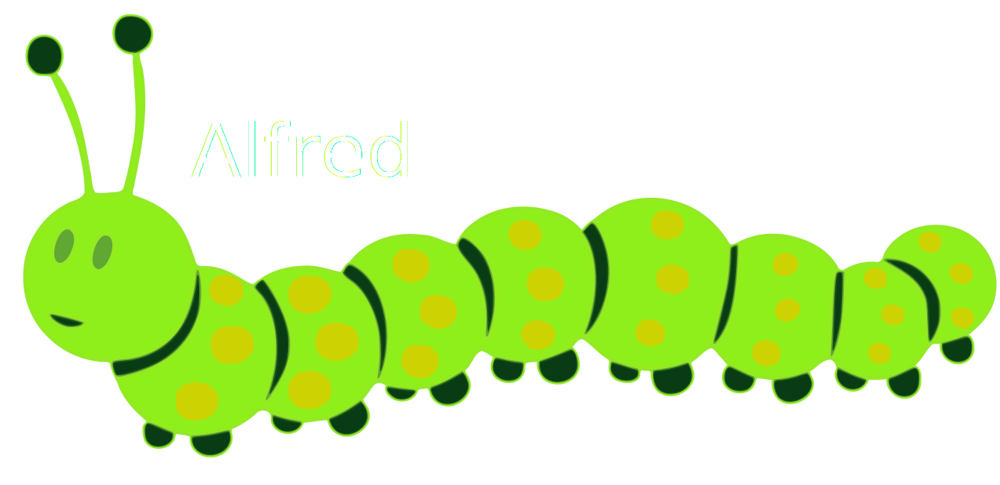

--- 
title: Passwords and Phishing
subtitle: Cybersecurity Part 1 of &infin;
date: September 2019
css: override.css
transition: zoom
theme: night
width: 1280
height: 720
---

# Why does cybersecurity matter?

::: notes
- Communicate in binary today.
- 1 = Yes; 0 = No.
- Who will use a computer today?
- Who will deal with confidential information today?
- Cybersecurity is necessary for us to do our work.
- We are entrusted with data from about 25,000 people.
- We are responsible to keep this data private and confidential.
- Much of this data lives in the cloud (Office 365, Google Suite, Better Outcomes) or is accessible via the internet (via VPN)
:::

# How can we protect ourselves?
> - Technological solutions
> - Physical solutions
> - User education

# Today's focus
> - Strong passwords
> - Multi-factor authentication
> - Email safety 

# SEED's Password Policy

> - What?
> - Why?
> - How?
> - Do I have to?
> - Okay fine, when?

# Password Pop Quiz!

## Is this a strong password?{data-transition="slide-in fade-out"}

    password

[Yes](#){.navigate-next .button .yes}
[No](#){.navigate-next .button .no}

## Is this a strong password?{data-transition="fade-in slide-out"}

    password

[No.]{.no}

::::{.good}
>- It is 8 characters
::::
::::{.bad}
>- It is one of the most common passwords &#128558;
>- It only uses lowercase letters.
>- It is short.
>- It would be cracked almost instantly.
::::

## Is this a strong password?{data-transition="slide-in fade-out"}

    Password1

[Yes](#){.navigate-next .button .yes}
[No](#){.navigate-next .button .no}

## Is this a strong password?{data-transition="fade-in slide-out"}

    Password1

[No.]{.no}

::::{.good}
>- It is greater than 8 characters
>- It includes uppercase, lowercase, and numbers
::::

::::{.bad}
>- It is very common.
>- It is short.
>- It is not very complex.
>- It would be cracked almost instantly.
::::

## Is this a strong password?{data-transition="slide-in fade-out"}

    80Salter

[Yes](#){.navigate-next .button .yes}
[No](#){.navigate-next .button .no}

## Is this a strong password?{data-transition="fade-in slide-out"}

    80Salter

[No.]{.no}

::::{.good}
>- It is 8 characters
>- It includes uppercase, lowercase, and numbers
::::

::::{.bad}
>- It is short.
>- It is not very complex.
>- It could be easily guessed.
::::

## Is this a strong password?{data-transition="slide-in fade-out"}

    Summer2019

[Yes](#){.navigate-next .button .yes}
[No](#){.navigate-next .button .no}

## Is this a strong password?{data-transition="fade-in slide-out"}

    Summer2019

[No.]{.no}

::::{.good}
>- It is longer than 8 characters
>- It includes uppercase, lowercase, and numbers
::::

::::{.bad}
>- It is fairly short.
>- It is not very complex.
>- It is a very common pattern (season + year).
::::

## Is this a strong password?{data-transition="slide-in fade-out"}

    Vc3Xx$8j$lT0eqy#

[Yes](#){.navigate-next .button .yes}
[No](#){.navigate-next .button .no}

## Is this a strong password?{data-transition="fade-in slide-out"}

    Vc3Xx$8j$lT0eqy#

[Yes]{.yes}

::::{.good}
>- It is 16 characters long
>- It includes uppercase, lowercase, numbers, and symbols
>- It is very complex and random.
::::

::::{.but}
>- Would you remember it?
::::

## Is this a strong password?{data-transition="slide-in fade-out"}

    AlfredHas16Legs!

[Yes](#){.navigate-next .button .yes}
[No](#){.navigate-next .button .no}

## Is this a strong password?{data-transition="fade-in slide-out"}

    AlfredHas16Legs!

[Yes]{.yes}

::::{.good}
>- It is 16 characters long
>- It includes uppercase, lowercase, numbers, and symbols
>- It is memorable 
::::

{.alfred .fragment}

## What makes a password strong?{data-transition="slide-in fade-out"}

## A strong password is *unique.*{data-transition="fade"}
 
> - Don't share your passwords with others
> - Don't reuse a password for more than one account
> - Don't use the same passwords for personal and work accounts

## A strong password is *long.*{data-transition="fade"}

> - A strong password is at least 8 characters long
> - Longer passwords are stronger than shorter ones
> - We recommend 12 characters or longer
> - Note: Some sites limit you to 16 characters or fewer

## A strong password is *uncommon*...{data-transition="fade"}
 
> - Many passwords are easily guessed.
> - The things that are easiest for you to remember (addresses, birth dates, names, etc.) are the easiest for others to guess.
> - Many people use the same formulas and common words to create their passwords (for example: seasons).
> - Uncommon words are harder to guess.

## A strong password is *complex*...{data-transition="fade"}
 
> - A strong password includes characters from at least 3 of the following categories:
>     - Lowercase letters
>     - Uppercase letters
>     - Numbers
>     - Symbols (~!@#$%^&*_-+=`|\(){}[]:;"'<>,.?) 

## A password manager can help you {.center}

## A good password manager should...

> - Be secured with a strong password
> - Generate and remember strong passwords for you
> - Require multi-factor authentication to access

# What is Multi-factor Authentication (MFA)?

## Multi-Factor Authentication (MFA) is...

> - Something you know

::::{.nomarker margin-left=20px}
>- &#43;
:::: 

> - Something you have

## Something you know

> - Your fabulously secure new password!

## Something you have

> - Your cell phone
>     - Push notifications
>     - Text messages
>     - Phone calls
> - Your office phone
>     - Phone calls

# Why?{data-transition="fade"}

> - Weak passwords are one of the major vulnerabilities that could compromise  network security and data privacy  

# How?{data-transition="fade"}

> - Choose a new password following SEED's Password Policy.
> - This password will be for your computer login (*schachterk*) and email login (*kevin@seedwinnipeg.ca*).

## SEED's Password Policy
> - Choose a password at least 8 characters long
> - Choose at least 3 of the 4 character types
> - Don't reuse passwords for personal and work accounts
> - Don't share passwords with others
> - Don't use any of the example passwords from this presentation
> - Use Multi-Factor Authentication

# Do I Have To? &#128553;
>- Yes. 
>- Sorry [not sorry.]{.fragment}
>- A network is only as secure as its weakest link.

# When?

> - Later this month all staff will change passwords and setup MFA (exact date TBD).
> - We (SEED and Clear Concepts staff) will be available to help you.

# Email Safety

> - Let's catch some phish
> - Rules of thumb

# Catching Phish

> - Who is the sender?
> - What are they asking you to do?

# Rules of Thumb

> - Don't click that link.
> - Don't open that attachment.
> - Don't reply.
> - Don't send that money.